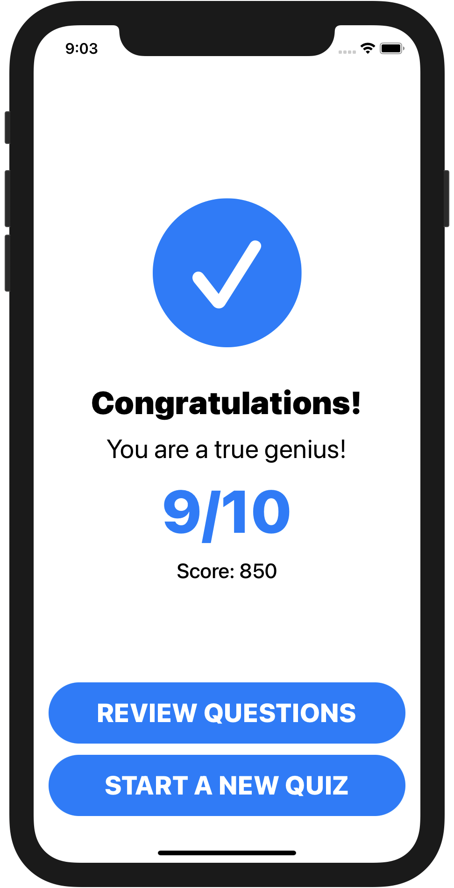

Tensai
======

    
    
    

    
    &nbsp;&nbsp;&nbsp;&nbsp;
    
    &nbsp;&nbsp;&nbsp;&nbsp;
    

Quiz yourself and see how much you know in this awesome trivia app! 🤓

“App Pitch”
-----------

  * **What is it?** It’s a trivia app.
  * **What does it do?** It generates a quiz of random trivia questions for the
    player to answer.
  * **Who is the app for?** Myself.
  * **Why do I need the app?** I want to be a trivia buff!

Key Features
------------

  * The player can select the category, difficulty level, question type, and
    number of questions in the trivia quiz. The questions are random and
    retrieved from the [*Open Trivia Database*](https://opentdb.com).
  * The player will have 15 seconds to answer each question in the trivia quiz.
    He/she will immediately know if he/she answered a question correctly or
    incorrectly. Regardless, the next question will be displayed three seconds
    after the current question is answered.
  * The player can review every question in the quiz. If he/she answered any
    question incorrectly, then the correct answer will be displayed below
    his/her answer for that question.
  * In order for the player to pass the quiz, he/she must get at least 70% of
    the questions right. If he/she did not pass, then he/she is given the chance
    to retry the quiz with the same configuration but different questions.

-----

The sound effects are from Zapsplat.com.
